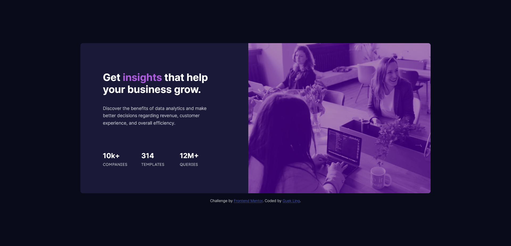

# Frontend Mentor - Stats preview card component solution

This is a solution to the [Stats preview card component challenge on Frontend Mentor](https://www.frontendmentor.io/challenges/stats-preview-card-component-8JqbgoU62). Frontend Mentor challenges help you improve your coding skills by building realistic projects. 

## Table of contents

- [Overview](#overview)
  - [The challenge](#the-challenge)
  - [Screenshot](#screenshot)
  - [Links](#links)
- [My process](#my-process)
  - [What I learned](#what-i-learned)
  - [Useful resources](#useful-resources)
- [Author](#author)
- [Acknowledgments](#acknowledgments)

## Overview
- [A Complete Guide to Flexbox](https://css-tricks.com/snippets/css/a-guide-to-flexbox/)

### The challenge

Users should be able to:

- View the optimal layout depending on their device's screen size

### Screenshot



### Links

- [Solution URL]()
- [Live Site URL]()

## My process

### What I learned

#### a. Setting CSS Variables

```css
:root {
  --main-background-colour: hsl(233, 47%, 7%);
  --card-background-colour: hsl(244, 38%, 16%);
  --accent-colour: hsl(277, 64%, 61%);
  --main-font-colour: hsl(0, 0%, 100%);
  --main-paragraph-font-colour: hsla(0, 0%, 100%, 0.75);
  --stat-heading-font-colour: hsla(0, 0%, 100%, 0.6);
  --main-font-size: 0.94rem;
  --main-font-family: 'Inter', sans-serif;
  --stat-heading-font-family: 'Lexend Deca', sans-serif;
}
```

#### b. Changing an Image using CSS

```html
<body>
  <div class="card">
    <div class="img-header"></div>
  </div>
</body>
```

```css
.img-header {
  background-image: url(./images/image-header-mobile.jpg);
  background-color: hsla(277, 64%, 61%, 0.8);
  background-size: cover;
  background-blend-mode: soft-light;
  filter: contrast(1.3) brightness(0.7);
}
```

#### c. Each `<div>` Taking Equal Space

```html
<body>
  <div class="card">
    <div class="img-header"></div>
    <div class="card-content"></div>
  </div>
</body>
```

```css
.card{
  display: flex;
}

.img-header {
  flex: 1; /* this is responsible for the equal space */
}

.card-content {
  flex: 1; /* this is responsible for the equal space */
}
```

### Useful resources

- [Responsive Web Design](https://kinsta.com/blog/responsive-web-design/) & [TailwindCSS Breakpoints](https://tailwindcss.com/docs/responsive-design)

## Author

- Frontend Mentor - [@guekling](https://www.frontendmentor.io/profile/guekling)
